```{r, include = FALSE}
knitr::opts_chunk$set(
  collapse = TRUE,
  comment = "#>"
)
```

```{r setup, echo=FALSE}
library(mesonetgdh)
```

# Step 1: Download the Visual C++ 2015 Restributable

The Microsoft Visual C++ 2015 Redistributable is a software library needed in order to install the Snowflake ODBC driver. First, go
[here](https://www.microsoft.com/en-us/download/details.aspx?id=48145) to download it.

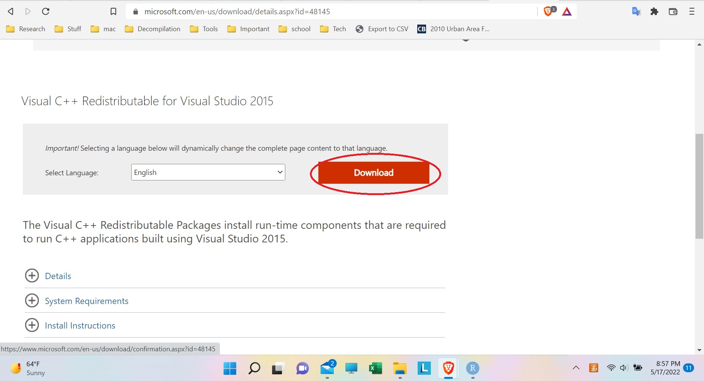{width=768px}{width=768px}

Then, when it asks, make sure to download the "X64" version:

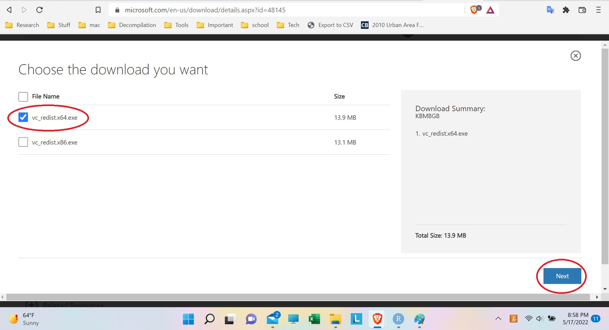{width=768px}

Finally, run the installer:

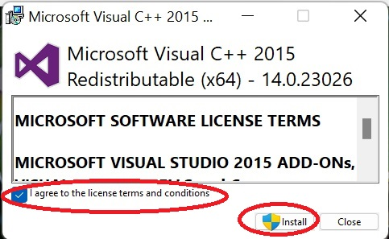{width=768px}

# Step 2: Downloading ODBC software

ODBC is the way R can connect to the snowflake database. For Windows, it can be downloaded [here](https://docs.snowflake.com/en/user-guide/odbc-windows.html) (with instructions).

Download the `snowflake64_odbc-<version>.msi` file:

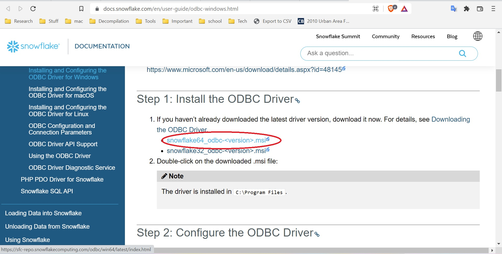{width=768px}

And run it:

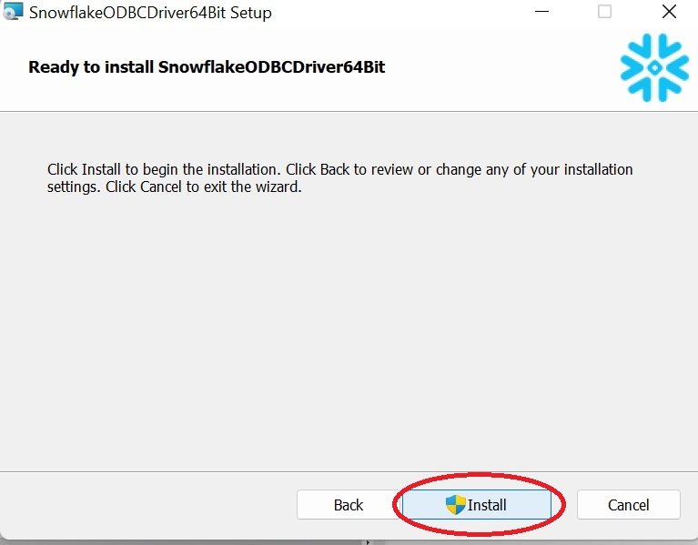{width=768px}


# Step 3: Set up ODBC

Go to the Windows start menu search bar, and search for "ODBC".Then open up "ODBC Data Sources (64-bit)":

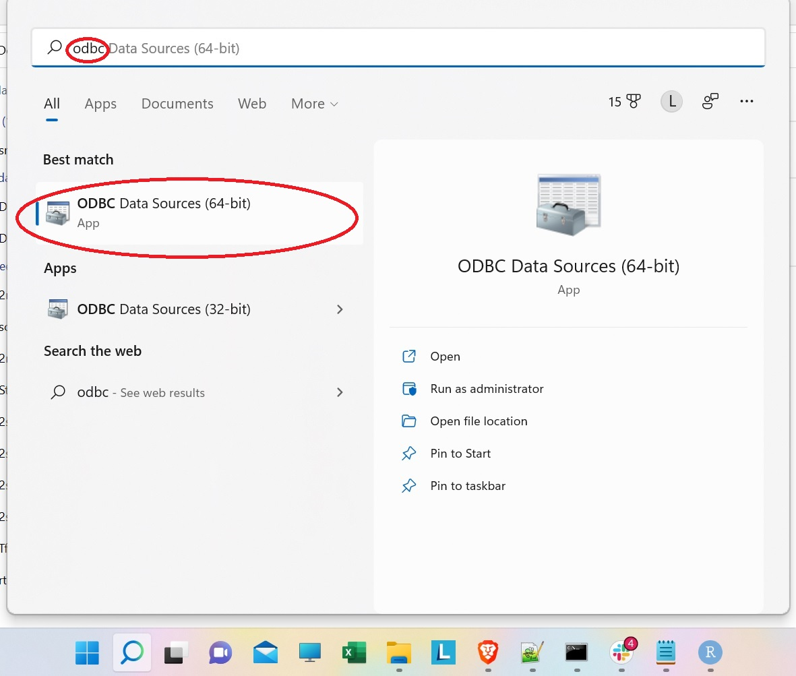{width=768px}

Once in the ODBC window, go to the "Drivers" tab and make sure that Snowflake shows up there:

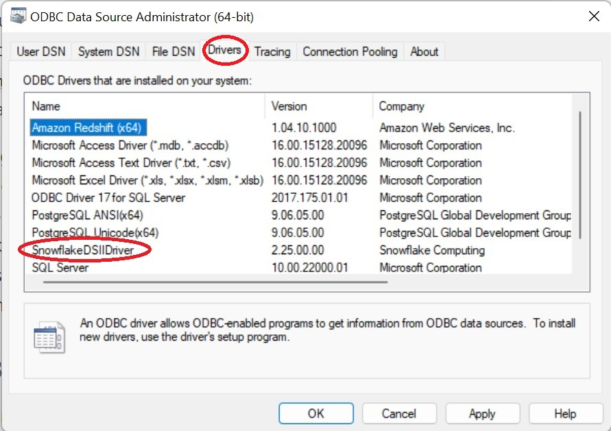{width=768px}

Now, go to the "System DSN" tab, and click the "Add" button to add the Stotz
data source:

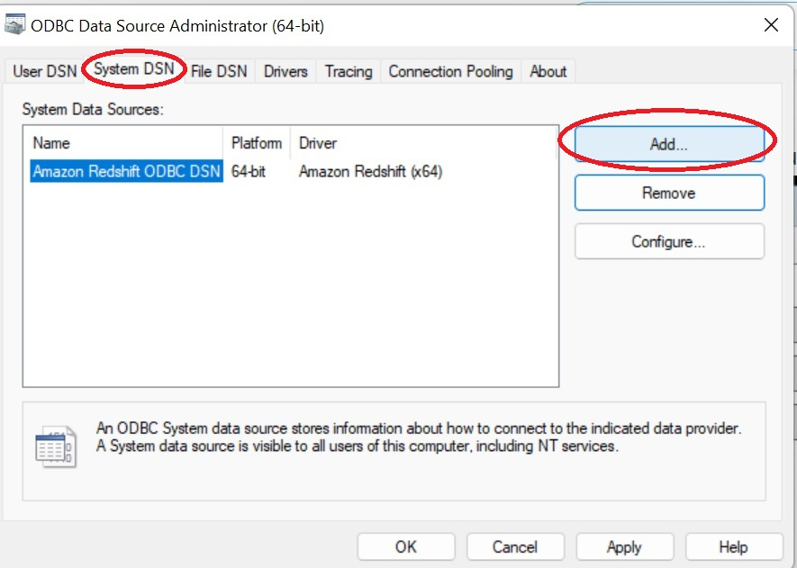{width=768px}

Now, set the driver that we are configuring the data source for to "SnowflakeDSII":

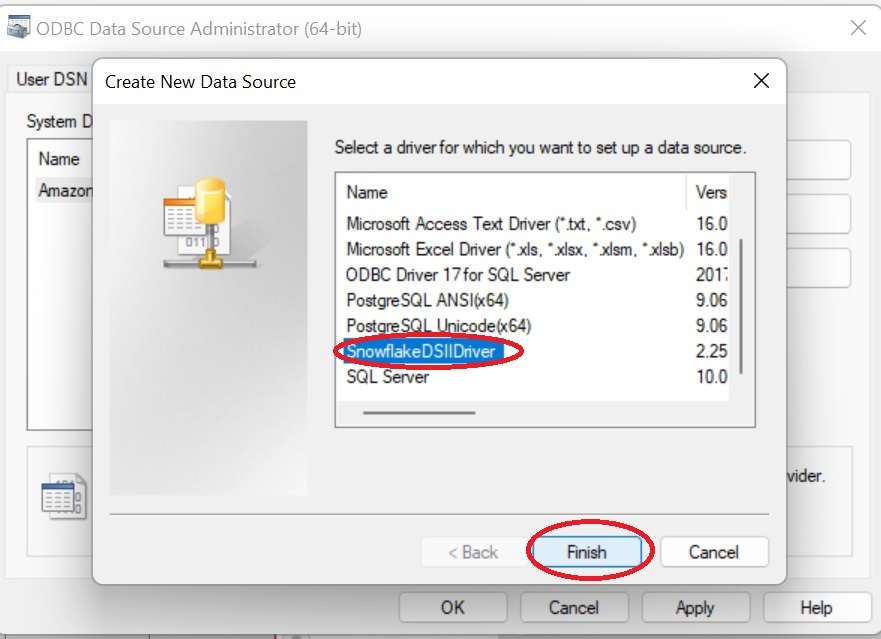{width=768px}

Now, we can set the options for the Snowflake data source so we can connect to the Snowflake database. Set the Data Source to "Stotz", the user to "STOTZ_GUEST", the server to "ut67101.us-east-2.aws.snowflakecomputing.com", and the warehouse to
"FIREHOSE". Then, click "OK":

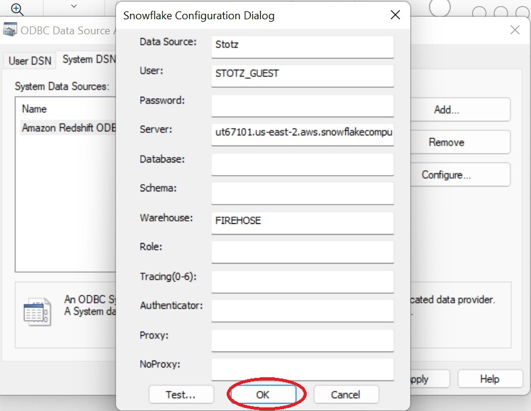{width=768px}

Now, back on the System DSN window, click "OK". This will save your Stotz data source and close the ODBC configuration window.

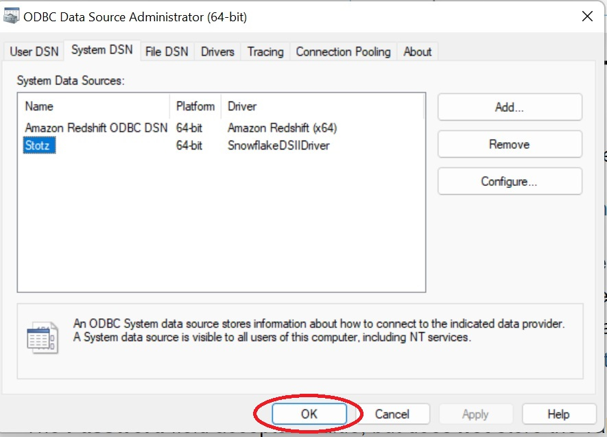{width=768px}

# Step 4: Setting up username and password

To securely store the username and password, create an .Renviron (no file extension) file in the Documents folder if it does not already exist:

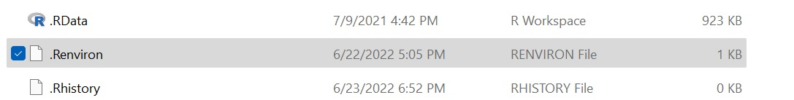{width=768px}
Open the file with Notepad (or create the file with Notepad if it does not exist), and set the MESONETGDH_UID and the MESONETGDH_PWD with the username and password for the Snowflake database:

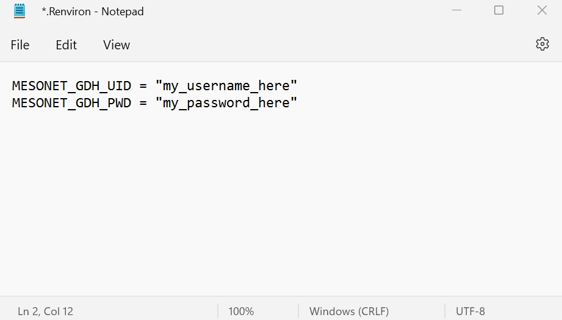{width=768px}

# Step 5: Testing the code in R

Finally, we can test the code in R. First, install the DBI and ODBC packages,
which allow R to connect to the Snowflake database through ODBC:

```r
install.packages(c("DBI", "odbc"))
```

Now, try connecting to the database:

```r
myconn <- DBI::dbConnect(odbc::odbc(), "Stotz", uid=Sys.getenv("MESONETGDH_UID"),
                         pwd=Sys.getenv("MESONETGDH_PWD"))
```

Then, try using the farm production database (this should return a data frame with zero rows and columns, one can also use dbExecute() instead of dbGetQuery() if a returned table is not needed):

```r
DBI::dbGetQuery(myconn, "USE FARM_PROD.FARM__PRODUCTION;")
```

Now, try pulling the data from the database (this should return a data frame with 10 rows):

```r
DBI::dbGetQuery(myconn, "SELECT FIELD_ID, CROP_NAME FROM FIELD_OPERATIONS LIMIT 10;")
```

Here is a screenshot showing querying the database in R:
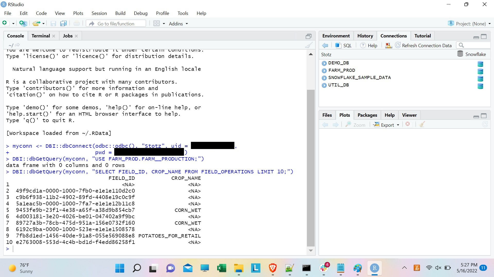{width=768px}
